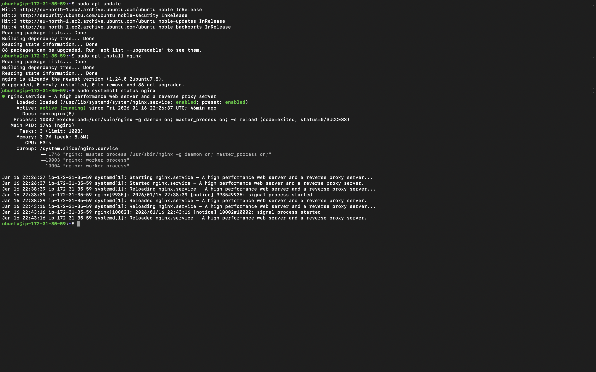
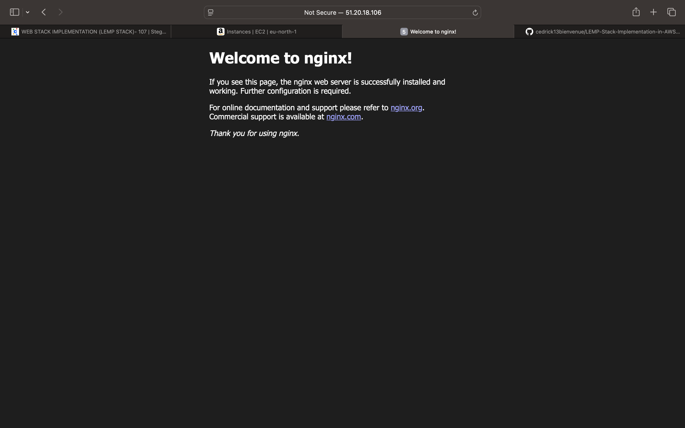
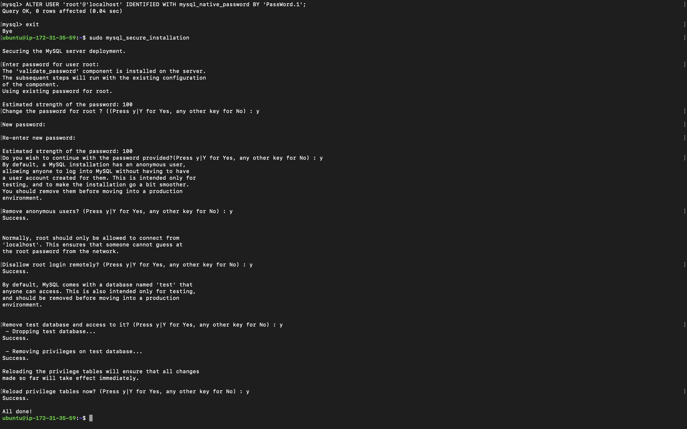
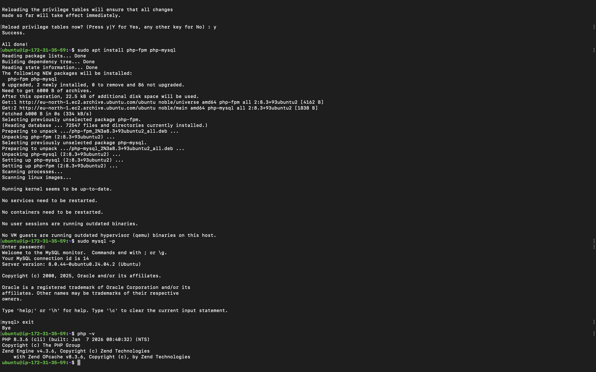
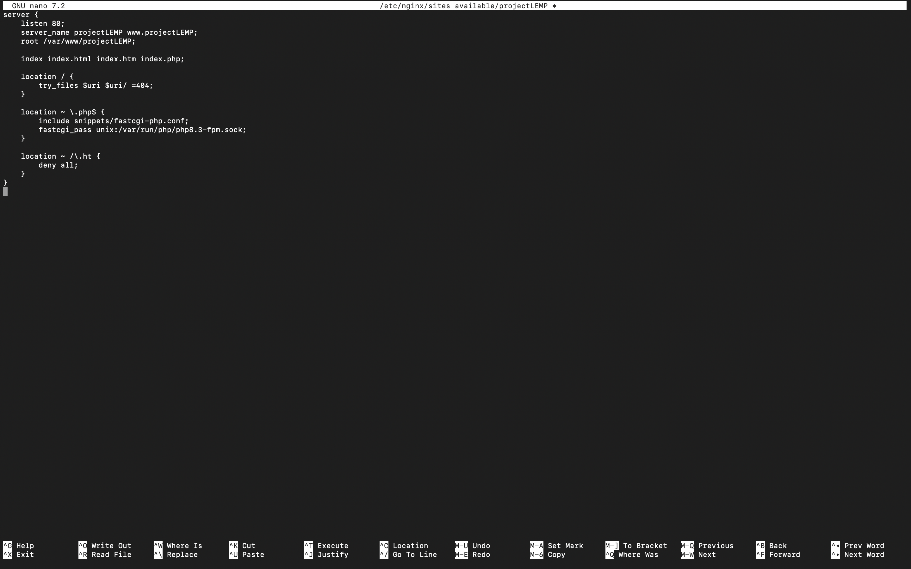
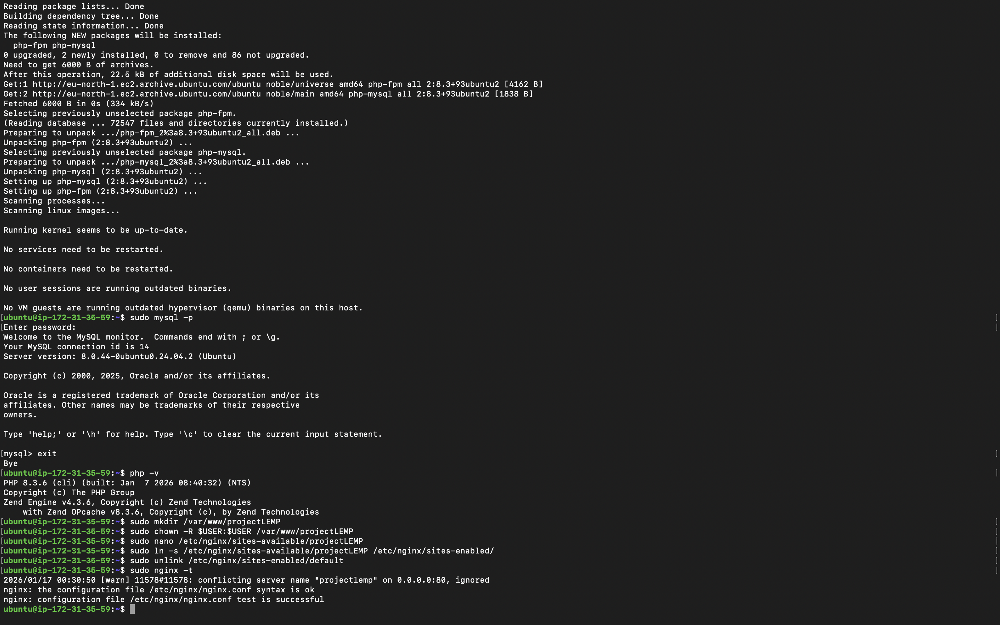
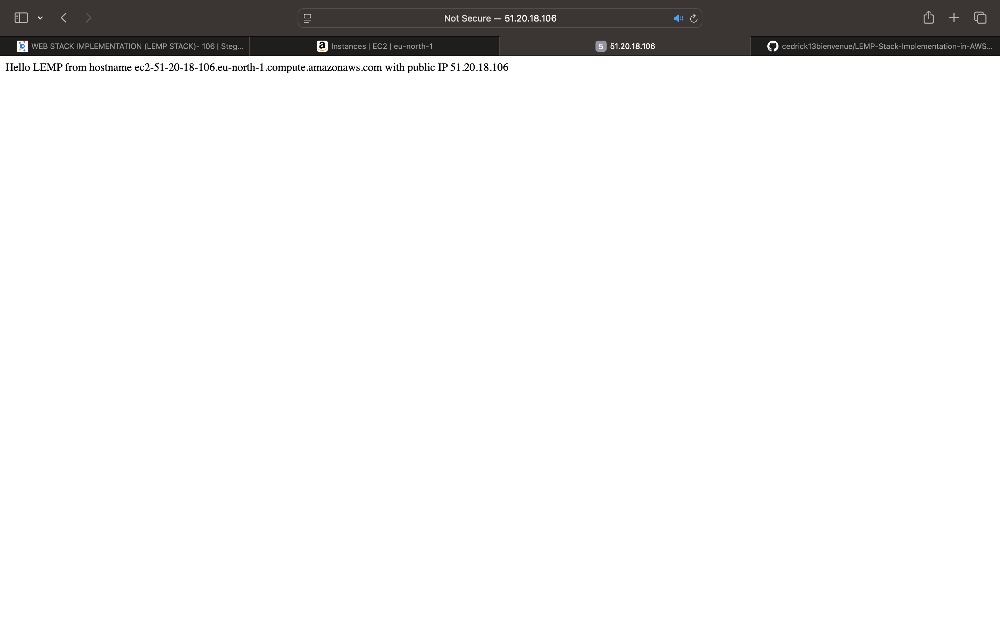
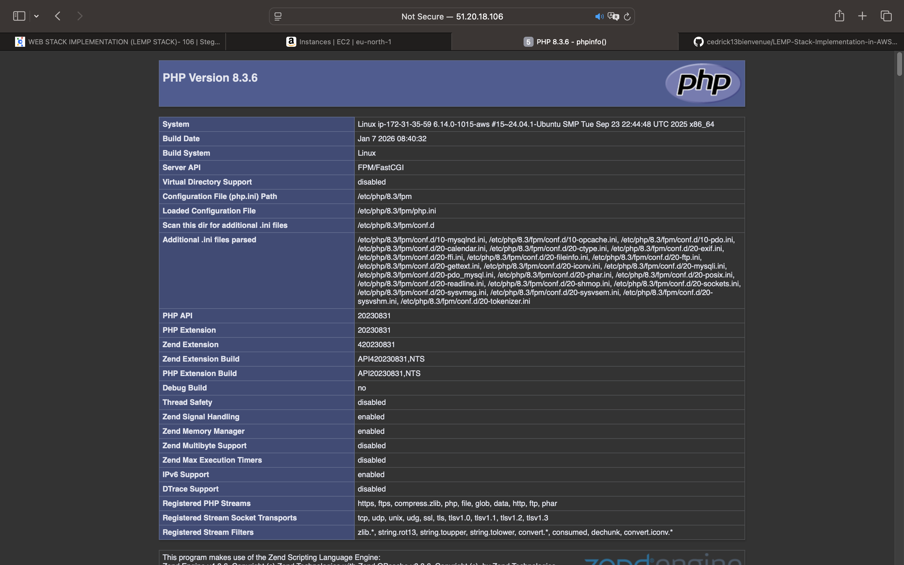
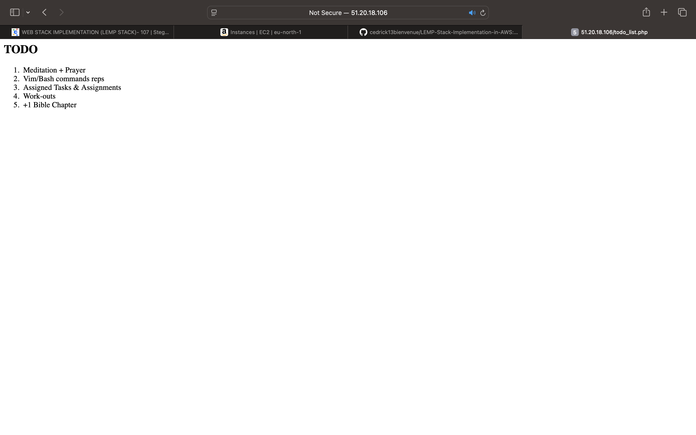

# Project: LEMP Stack Implementation on AWS

## Project Overview

This project involves the manual deployment and configuration of a **LEMP Stack** (Linux, NGINX, MySQL, PHP) on a virtualized Amazon EC2 instance. This implementation focuses on using NGINX as a high-performance web server, providing insight into server block configuration, process management with PHP-FPM, and cloud infrastructure security.

---

## Phase 1: Provisioning the Compute Engine (Linux & Nginx)

The foundation of the stack is an EC2 Instance running **Ubuntu 24.04 LTS**. Nginx serves as the web server, designed to handle high concurrency by using an asynchronous, event-driven architecture.

### 1.1 Installation and Service Management

To prepare the environment, synchronize the local package index before installing the Nginx service:

* **Update package list**
```bash
sudo apt update

```


* **Install Nginx**
```bash
sudo apt install nginx

```


* **Verify service status**
```bash
sudo systemctl status nginx

```


> **Expected Output:** The terminal should display a green indicator and the text **"Active: active (running)"**.
> 

### 1.2 Networking and Verification

Configure Security Group: Open Port 80 (HTTP) to 0.0.0.0/0 in the AWS EC2 Security Group to allow inbound web traffic.

* **Public IP Access:** Navigate to the following URL in your browser:
```text
http://<YOUR_PUBLIC_IP>:80

```


> **Web Preview:** The **"Welcome to nginx!"** landing page should appear, confirming the server is accessible from the internet.
> 

---

## Phase 2: Data Persistence Layer (MySQL)

A relational database is required to store application data and manage user records.

### 2.1 Installation

* **Install MySQL Server**
```bash
sudo apt install mysql-server

```


* **Access MySQL Shell**
```bash
sudo mysql

```


> **Expected Output:** The MySQL administrative prompt `mysql>` should appear.
> 


### 2.2 Security Hardening

Run the security script to set a root password, remove anonymous users, and disable remote root logins:

```bash
sudo mysql_secure_installation

```

> **Expected Output:** The script should guide you through the configuration and finish with **"Success. All done!"**.
> 

---

## Phase 3: Application Layer (PHP)

Unlike Apache, Nginx does not contain a native PHP module. It requires **PHP-FPM** (FastCGI Process Manager) to process PHP scripts and pass them to the web server.

### 3.1 Installation

* **Install PHP-FPM and PHP-MySQL**
```bash
sudo apt install php-fpm php-mysql

```


* **Verify PHP installation**
```bash
php -v

```


> **Expected Output:** PHP version information such as **"PHP 8.3.6"** should be displayed.
> 

---

## Phase 4: Server Block Configuration and Directory Setup

Nginx uses **Server Blocks** (similar to Virtual Hosts in Apache) to encapsulate configuration details and host multiple domains on a single server.

### 4.1 Custom Web Root Setup

* **Create project directory**
```bash
sudo mkdir /var/www/projectLEMP

```


* **Assign ownership**
```bash
sudo chown -R $USER:$USER /var/www/projectLEMP

```


* **Create Nginx server block configuration**
```bash
sudo nano /etc/nginx/sites-available/projectLEMP

```
>


### 4.2 Activation and Testing

* **Link configuration to sites-enabled**
```bash
sudo ln -s /etc/nginx/sites-available/projectLEMP /etc/nginx/sites-enabled/

```


* **Disable default Nginx host**
```bash
sudo unlink /etc/nginx/sites-enabled/default

```


* **Test Nginx configuration syntax**
```bash
sudo nginx -t

```


* **Reload Nginx**
```bash
sudo systemctl reload nginx

```


> **Expected Output:** The syntax check should return **"syntax is ok"** and **"test is successful"**.
>

---

## Phase 5: Custom Web Root Validation (Static Content)

We verify that the Nginx Server Block is correctly serving static files from our custom directory.

### 5.1 Static Index Test

* **Create a custom index file** using server metadata:
```bash
sudo echo 'Hello LEMP from hostname' $(TOKEN=`curl -X PUT "http://169.254.169.254/latest/api/token" -H "X-aws-ec2-metadata-token-ttl-seconds: 21600"` && curl -H "X-aws-ec2-metadata-token: $TOKEN" -s http://169.254.169.254/latest/meta-data/public-hostname) 'with public IP' $(TOKEN=`curl -X PUT "http://169.254.169.254/latest/api/token" -H "X-aws-ec2-metadata-token-ttl-seconds: 21600"` && curl -H "X-aws-ec2-metadata-token: $TOKEN" -s http://169.254.169.254/latest/meta-data/public-ipv4) > /var/www/projectLEMP/index.html

```


* **Access via browser:** `http://<YOUR_PUBLIC_IP>:80`

> **Web Preview:** A plain text line showing your instance's unique DNS name and IP address should appear.
>

---

## Phase 6: PHP Integration and Precedence (Dynamic Content)

The final phase validates that Nginx is correctly communicating with **PHP-FPM**.

### 6.1 PHP-FPM Diagnostic Test

* **Create the test file:**
```bash
nano /var/www/projectLEMP/index.php

```


```php
<?php phpinfo(); ?>

```


* **Access via browser:** `http://<YOUR_PUBLIC_IP>:80/index.php`

> **Web Preview:** The purple **PHP Version Information Page** should be displayed.
>

---

## Phase 7: Data Retrieval from MySQL with PHP

In this final phase, we establish a dynamic connection by creating a test database with a "To do list" and configuring the Nginx website to query and display this data.

### 7.1 Database and User Configuration

First, connect to the MySQL console to provision the backend storage:

* **Access MySQL Shell:**
```bash
sudo mysql

```


* **Create a new database:**
```sql
CREATE DATABASE `example_database`;

```


* **Create a dedicated user and grant privileges:**
```sql
CREATE USER 'example_user'@'%' IDENTIFIED WITH mysql_native_password BY 'PassWord.1';
GRANT ALL ON example_database.* TO 'example_user'@'%';
exit

```


### 7.2 Table Creation and Data Entry

Now, login as the new user to create a test table and insert sample records:

* **Login as the custom user:**
```bash
mysql -u example_user -p

```


* **Create the `todo_list` table:**
```sql
CREATE TABLE example_database.todo_list (
  item_id INT AUTO_INCREMENT,
  content VARCHAR(255),
  PRIMARY KEY(item_id)
);

```


* **Insert sample data:**
```sql
INSERT INTO example_database.todo_list (content) VALUES ('Meditation + Prayer');
INSERT INTO example_database.todo_list (content) VALUES ('Vim/Bash commands reps');
INSERT INTO example_database.todo_list (content) VALUES ('Assigned Tasks & Assignments');
INSERT INTO example_database.todo_list (content) VALUES ('Work-outs');
INSERT INTO example_database.todo_list (content) VALUES ('+1 Bible Chapter');

```


* **Verify records and exit:**
```sql
SELECT * FROM example_database.todo_list;
exit

```


> **Expected Output:** You should see your rows of data displayed in the terminal.
>

---

### 7.3 Dynamic PHP Script Deployment

Finally, create a PHP script that connects to MySQL and renders the list in your browser.

* **Create the PHP file:**
```bash
nano /var/www/projectLEMP/todo_list.php

```


* **Paste the following logic:**
```php
<?php
$user = "example_user";
$password = "PassWord.1";
$database = "example_database";
$table = "todo_list";

try {
  $db = new PDO("mysql:host=localhost;dbname=$database", $user, $password);
  echo "<h2>TODO</h2><ol>";
  foreach($db->query("SELECT content FROM $table") as $row) {
    echo "<li>" . $row['content'] . "</li>";
  }
  echo "</ol>";
} catch (PDOException $e) {
    print "Error!: " . $e->getMessage() . "<br/>";
    die();
}
?>

```


* **Access via Browser:**
```text
http://<YOUR_PUBLIC_IP>/todo_list.php

```


> **Web Preview:** A numbered list titled **"TODO"** should appear, showing the items you inserted into your database.
>

## Conclusion and Cleanup

The LEMP stack is fully operational. To maintain security, remove diagnostic files:

```bash
sudo rm /var/www/projectLEMP/index.php
sudo rm /var/www/projectLEMP/index.html

```

---